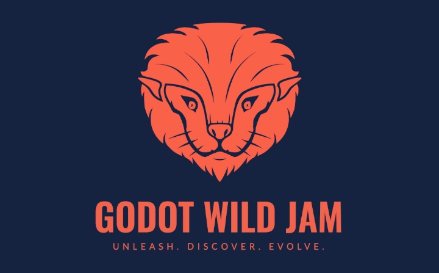
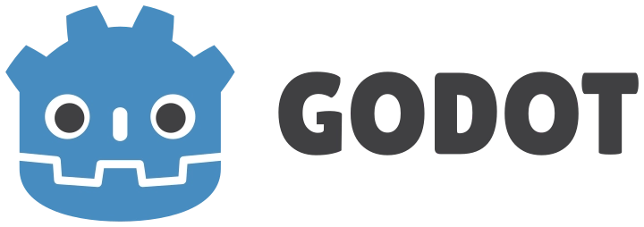
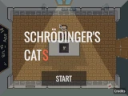
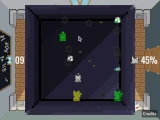
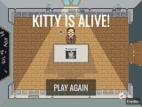

+++
title = "🎮 Participer à une game jam"
date = 2023-11-23
slug = "participer-a-une-game-jam"
template = "post.html"

[taxonomies]
tags = [ "Game design", "Godot Engine", "Game Jam" ]

[extra]
menu = "blog"
summary_img = "gwj_logo_full.webp"
summary = "Enfin c'est fait : après des mois à tergiverser, j'ai enfin participé à ma première game jam !"

+++

> There is a difference between knowing the path and walking the path.Morpheus, former programmer converted into cult guru

## C'est quoi une game jam ?

Une _game jam_ est un _hackaton_.  
Euh… voilà.  
😅 Quoi ? Ce n'est pas encore clair ? Ah…

Un _hackaton_ est une compétition de programmation en temps limité (généralement quelques jours), pour répondre à un besoin ou apporter de l'innovation dans un secteur, une sorte de concours d'idée où la finalité et de présenter un prototype.  
Une _game jam_ est un hackaton dans le monde du jeu vidéo. Généralement un thème est donné ou d'autres contraintes comme le style de jeu, la technologie, etc.

Cela faisais longtemps que je voulais m'essayer au game design, et avec mon camarade [Adrien](https://iglou.eu/), j'ai participé à ma première game jam ! 😋

## Une Game Jam spécial Godot

Nous avons concouru à la [**Godot Wild Jam #63**](https://itch.io/jam/godot-wild-jam-63), dont le thème était "les chats". 🐈‍⬛  
Pendant 9 jours : c'est le temps limite pour poster son jeu, et je peux vous assurer que c'est court, et ne serait-ce qu'arriver au bout de l'exercice est déjà difficile ! Sur plus de 1000 participants inscrits, seulement 146 projets on été effectivement rendus.

Pourquoi avoir cibler cette jam ?
Deux raisons :

- la durée me paraissait appropriée en tant que débutant (certaines jams durent… 3 heures ! 🤪)
- Godot Engine !

## Godot Engine

**Godot Engine** est un moteur de jeu _libre_ et _open-source_, créé dans sa premère version stable en 2014.

Il se pose en alternative aux géants que sont _Unreal Engine_ (1998) et _Unity_ (2005). A l'instar de ces masdodontes, Godot permet la création de jeu en 2D ou 3D.  
Le projet est actuellement très mature et utilise un langage appelé _GD Script_ qui est très fortement inspiré de Python, mon langage de prédilection. Son interface a également pas mal de similtudes avec **Blender** que j'utilise ponctuellement depuis une bonne décennie.

## Notre jeu

Pour ne pas risquer un burnout et/ou un jeu inachevé en fin de jam, nous avons opté pour la simplicité : un jeu où l'on contrôle un petit chat qui collecte des éléments.

Pour palier cette humilité technique, nous avons proposé un contexte original : on contrôle le chat de Shrödinger, qui est dans sa boite, et a donc une espérance de vie de 50% au moment où son tordu de maître ouvrira la boite.  
Mais notre matou ne va pas se laisser faire ! Il va collecter des particules dans sa boite, et cela va générer pas mal de choses bizarres comme l'apparition d'une boite dans la boite, et de fantômes de ses précédents passages.  
Plus on avance et plus la situation devient chaotique.

Adrien a réalisé les graphismes et l'animation. Il est développeur à la ville, mais sa vraie passion est l'animation. Je me suis chargé de la plupart des mécaniques de jeu et de la programmation.

Vous pouvez l'essayer sur [itch.io](https://toasted-brains.itch.io/schrdinger-cats).

Le code source complet est disponible [ici](https://github.com/gil-x/schrodinger-cats).

## Retour d'expérience

Faire un jeu vidéo de ses mains est tout simplement exaltant !  
Dans la vie quotidienne de développeur web, on doit rester sérieux, faire en sorte que le site soit fidèle au concept, au template, que les fonctionnalités soit programmées exactement comme prévu.  
Alors que dans un jeu, on part d'un concept, d'idées, mais dans une démarche itérative d'amélioration. La liberté est immense, et l'objectif est simple : le **fun** !  
Mon petit personnage félin vomit (🤢) quand il touche son fantôme, et ça fait rire le joueur ! Qui plus est quand on repasse dans la flaque de vomi, on glisse, ce qui peut avoir des conséquences facheuses sur sa partie.  
J'avoue ne jamais avoir essayé de glisser un chat qui vomit dans une application web pour un client. 🤔 A tester peut être…

Ce qui est intéressant en passant du web au game design, c'est que tout ce qui est UX/UI a clairement sa place dans un jeu, ainsi que la pédagogie et l'instantanéité de prise en main.

🤖 Une seule chose est sûre : il y aura d'autres game jams !
