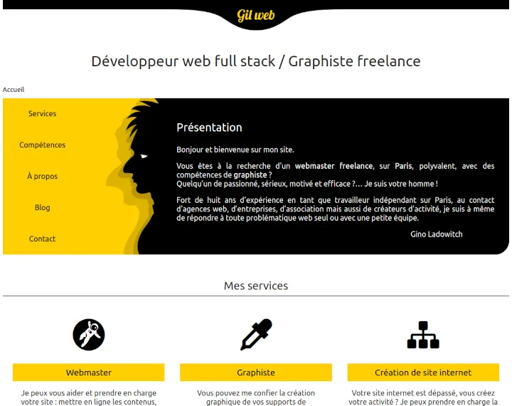
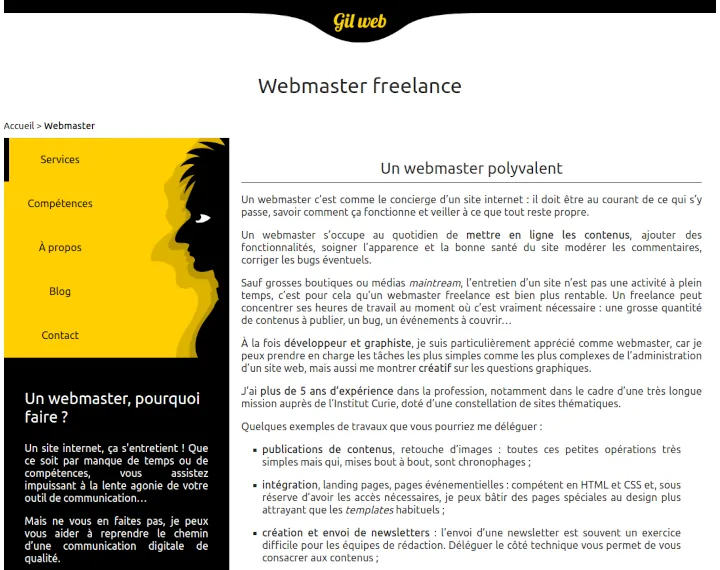
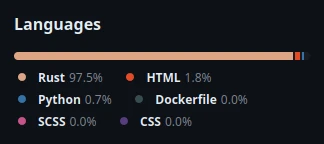

+++
title = "J'ai refait mon site avec Zola 🍾"
date = 2023-10-19
slug = "faire-son-site-avec-zola"
template = "post.html"

[taxonomies]
tags = [ "EcoConception", "JamStack", "Tech", "Webdesign", "Zola"  ]

[extra]
menu = "blog"
summary_img = "zola_vs_hugo.webp"
summary = "Je crois que j'ai enfin un site perso qui tient la route ! Quelques mots sur les choix techniques."

+++

> Do or do not, there is no try.Yoda, CTO at Jedi inc.

## Petit historique auto-critique

On dit que les cordonniers sont les plus mal chaussés n'est-ce pas ? Et bien les développeurs web n'ont pas les meilleurs sites webs…  
Cela fait plus de 15 ans que j'ai un site internet pour faire la promotion de mon activité, au départ c'était essentiellement de l'illustration et des prestations de graphiste, mais progressivement j'ai appris à coder proprement, appris le **SEO**, affûté ma culture de l'**UX/UI**.

En 2018 j'ai revu mon identité graphique avec des couleurs bien pêchues, pour sortir de mes habitudes de discrétion maladive.  
Jaune / Noir : ça claque, et c'est **accessible**.

Voici le design juste avant celui que vous avez sous les yeux :

J'ignore quelle mouche m'a piqué (enfin, si je sais : la flemme, le manque de temps), mais j'avais trouvé que c'était un bon point pour l'**UX** d'avoir un menu de forme différente en homepage et en sous-page… Et j'ai laissé cette _abomination_ en ligne des années. 💩

😓 Pardon.

## Choix technique

J'ai toujours fait mes sites porfolio en HTML/CSS pur, pour des questions de performances et de simplicité. Et aussi parce que je n'avais pas de contenu dynamique.  
Aujourd'hui j'ai envie de causer, de partager des connaissances, des anecdotes, des dessins. Besoin d'un blog quoi.

Bien que je maîtrise parfaitement le CMS _Wordpress_ pour la réalisation de blogs, solution très demandée par mes clients, et que j'arrive à obtenir d'excellentes performances (en faisant des thèmes _from scratch_), je trouve que c'est une solution très lourde, une véritable usine à gaz PHP, qui plus est, peu sécurisée par défaut (et étant très populaire, les attaquants sont très nombreux).

Pour moi qui prône l'**éco-conception**, il était hors de question d'utiliser une usine à gaz pour afficher quelques pages web. Je mets un point d'honneur à optimiser toutes mes réalisations, à rester frugal sur l'utilisation des milliers d'outils web disponibles.

## Zola c'est le mec qui a écrit des gros livres non ?

Oui, aussi !  
Mais [Zola](https://www.getzola.org/) c'est également le nom d'une application pour générer des _sites statiques_.

Aujourd'hui il existe des alternatives aux CMS pour réaliser des sites vitrine ou blogs, plutôt que de fabriquer les pages à la demande (en _PHP_ ou autre), du HTML est construit et mis en ligne. Autour de ces solutions on peut ajouter un outil pour faciliter l'administration (qui se fait généralement avec des fichiers Markdown, pas aussi ergonomique qu'un _WYSIWYG_ pour un néophyte), gérer les formulaires, ou autres fonctionnalités qui demandent plus qu'un simple affichage.  
On parle de **jamstack**, et [ce site](https://jamstack.org/generators/) liste un grand nombre de projets de ce type.

Pourquoi avoir choisi **Zola** ? Et bien déjà par conviction personnelle, j'ai écarté toutes les solutions à base de _JavaScript_ ou _TypeScript_, pour moi le _JS_ est un monstre qu'il faudrait enterrer au plus vite, et le _TS_ est une surcouche très rigoureuse mais… qui se compile en… JS. Vraiment, ça me bloque.  
Bien que je parle **Python** couramment, j'estime que la rapidité d'exécution et la puissance de calcul (écologie, tout ça…) est un facteur important.  
Ça élimine beaucoup de candidats, et donc on sent bien qu'on va se rapprocher des langages compilés. Deux ont bien la côte : **Golang** et **Rust**.

- _Golang_, je suis en train de m'y mettre, c'est simple, efficace, supporté par _Google_, parfait pour les usages web.
- _Rust_, j'ai essayé, je me suis cassé les dents, la courbe d'apprentissage est vertigineuse, et c'est fantastique pour réaliser des applications très optimisées (système, jeux…), mais je laisse ça aux élites, humblement.

Mais j'ai tout de même opté pour **Zola**, qui est codé en _Rust_, parce que :

- **Tera** le _moteur de template_ de **Zola** est plus sympa à mon goût
- les gens qui font du _Rust_ sont des tueurs en programmation
- la rapidité d'exécution un poil au-dessus des autres (mais franchement, à moins de générer des centaines de sites sur un serveur, ce n'est que de la frime !)

🤩 Moi quand je vois ça, ça me rassure :

## Bilan : Zola, oui, c'est bien

Je suis arrivé à mes fins, et je suis plutôt content de l'outil, malgré tout de même quelques galères : la documentation est très laconique, et il n'y a pas des tonnes de forums sur le sujet, donc j'ai parfois dû aller chercher des [exemples](https://github.com/getzola/zola/blob/master/EXAMPLES.md) ou regarder dans le [code source](https://github.com/getzola/zola).  
Un jour je testerai [Hugo](https://gohugo.io/), son concurrent en Golang, pour me faire une idée.

Si cela peut vous aider, le [code source](https://github.com/gil-x/gilweb) de mon site est disponible sur mon Github.  
Si vous débutez avec Zola, gardez la [doc de Tera](https://keats.github.io/tera/docs/) sous le coude, et pensez à logger les variables, ça aide énormément ({{\_\_tera_context}}) !
