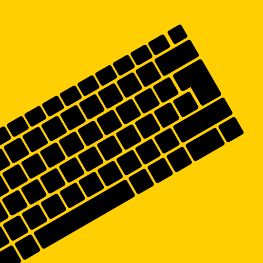

+++
title = "Développement d'applications"
template = "page.html"

[extra]
menu = "services"
+++

<h2 class="h2">Un programme sur-mesure parfaitement adapté à votre besoin.</h2>

Chaque projet est unique et, en tant que développeur d'applications chevronné, je m'engage à créer des solutions sur-mesure, parfaitement adaptées à vos besoins.

<h2 class="h2">Le Python, mon fer de lance</h2>

Mon expertise en langage Python constitue le socle de mes services. Que vous envisagiez une application web dynamique, un logiciel de traitement de données ou une automatisation sophistiquée, je code chaque élément de votre vision avec précision et efficacité.

<h2 class="h2">Exploration de Golang :</h2>

Soucieux de rester au top niveau, j'explore activement le langage Golang pour répondre à des défis technologiques toujours plus exigeants et éco-conçus. Go est un langage compilé moderne, il est beaucoup moins énergivore que Python, et nettement plus rapide à l'exécution.

<h2 class="h2">Godot Engine : pour des interfaces riches</h2>

Lorsque un projet requiert une interface graphique riche et/ou complexe je m'appuie sur la puissance de Godot Engine, un logiciel open-source destiné à la création de jeux vidéo, qui permet de facilement réaliser des interfaces audacieuses et offrir des possibilités d'interaction sans limite.

[Contactez-moi](@/contact.md) dès aujourd'hui pour discuter de votre projet d'application. Ensemble, nous transformerons votre vision en une réalité numérique.

BONUS

{{ gallery() }}

Le Python est le cœur de mon métier. Sa polyvalence me permet de créer des applications robustes, des scripts d'automatisation efficaces, et d'explorer des projets de scraping de données avec une précision inégalée. En tant que passionné de technologie, je m'aventure également dans le monde émergent de Golang, explorant ses possibilités et l'intégrant dans mes projets.
